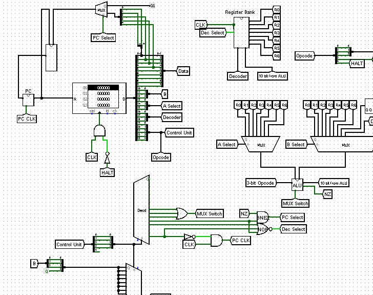

# 10-bit-CPU
### 10-bit CPU

1. Open the CPU.circ file with [logisim](http://www.cburch.com/logisim/) circuit simulator
2. Right click the RAM to load test file
3. Operation support:
  1. **AND**: Bitwise AND of registers A and B.
  2. **OR**: Bitwise OR of registers A and B.
  3. **NOT**: Negate register A.
  4. **ADD**: ADD registers A and B.
  5. **MOV**: Copy register A.
  6. **SLL**: Shift Left Logical.
  7. **SRL**: Shift Right Logical.
  8. **SUB**: Subtract the register B from register A.
  9. **ADDI**: Add the instruction data to register A.
  10. **SUBI**: Subtract the instruction data from register A.
  11. **8MOVI**: Copy the instruction data.
  12. **BNEZ**: Compare the Dest register with 0. If not zero, then add the lower 5 bits of the immediate data to the PC, and place the result              in the PC. 
  13. **NOP**: No registers, other than the PC, should change during this instruction cycle.
  14. **HALT**: Stop the CPU from executing any further instructions.
  ### Screenshot:
  
